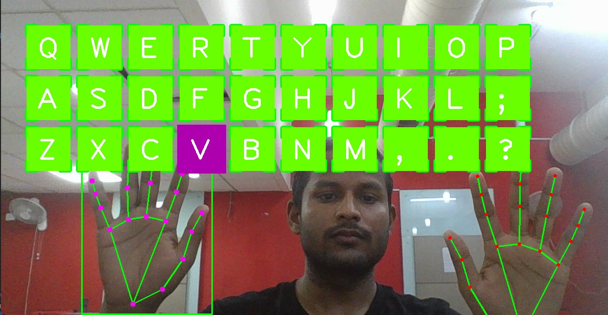

# **Computer Vision**
In this Readme File I have defined how to run the files in this repository.

# Requirments :
* Install Python 3.7.6
    * Install using link :
        * For Window user : https://www.python.org/ftp/python/3.7.6/python-3.7.6-amd64.exe
        * For Mac User  : https://www.python.org/ftp/python/3.7.6/python-3.7.6-macosx10.9.pkg
* Install Jupyter Notebook
    * Run this Command in Command prompt :
        * pip install jupyter notebook
* Install Mediapipe
    * Run the following command in jupyter notebook cell
         * !pip install mediapipe --user
* install pydirectinput (for Hill Climb and temple run automation)
    * Run the command in jupyter notebook cell :
         * !pip install pydirectinput
* # Folder 1 .   Emotion Detection :
  ## In this folder we have Four files
   
   * **Emotion_Detection.h5** : This is the model which is already trained.
   * **haarcascade_frontalface_default.xml** : This file Contain function that are needed to clasify face.
   * **Test.py**  : This is the file which needed to be run in order to detect your expression.
   * **Train.py** : If you want to train the model on your own dataset. So you can give your data of face by using this file.

    Now To run this project on pretrained model run the test file By using the following commands :

    * windows user  : python test.py
    * linux user  : python3 test.py
    
Happy 😀

Neutral 🙂

Surprise 😮

* # Folder 2 .   Lecture Of Computer Vision :
## In this folder we have Four files
s   
   * **CV Notes 1** : This is the notes part one of computer vision lecture.
   * **Cv Notes 2** : This is the notes part 2 of Computer vision Lecture. 
   * **Hill Climb Automation**  :  This is the project of Computer Vision in which both openCv and Mediapipe is used. 
        *   To run this project : 
            * Open Jupyter Notebook
            * Run the Code using shift + enter
         
   
   * **OpenCv and Mediapipe** : This is the code if someone wants to learn open cv and mediapipe from scratch.
        * To run the code 
             * Open Jupyter Notebook
             * Run the code using shift + enter

* # 3 . Gym Assistant : 
    ## This is the ipynb file which needed to be run in jupyter notebook to check your push - ups count and up down counts.

    * To run 
        * Open file in jypyter notebook
        * Press shift + enter on each code block
         

* # 4 . Temple Run Automation  : 
    ## This is the extendsion of automation of hill climb game. In this we are automating the  populated temple run game.

    * To run 
        * Open file in jypyter notebook
        * Press shift + enter on each code block
         

* # 5 . Virtual Keyboard  : 
    ##  Now a days technology is faster and wireless so we got an idea to capture keys without any touch and presented our virtual keyboard.

    * To run 
        * Open file in jypyter notebook
        * Press shift + enter on each code block
         